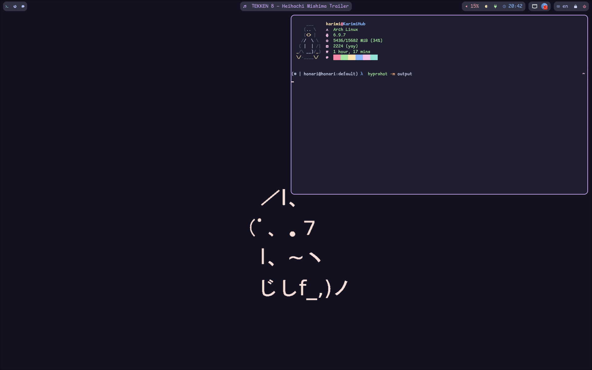

# Hypr

Hyprwm (Hyprland, Hyprlock and Hypridle) configurations

[](https://results.pre-commit.ci/latest/github/mhkarimi1383/hypr/main)



## Installation

> Before getting started, backup your current configuration

Run the command below and (re-)launch hyprland

```bash
git clone https://github.com/mhkarimi1383/hypr ~/.config/hypr
```
